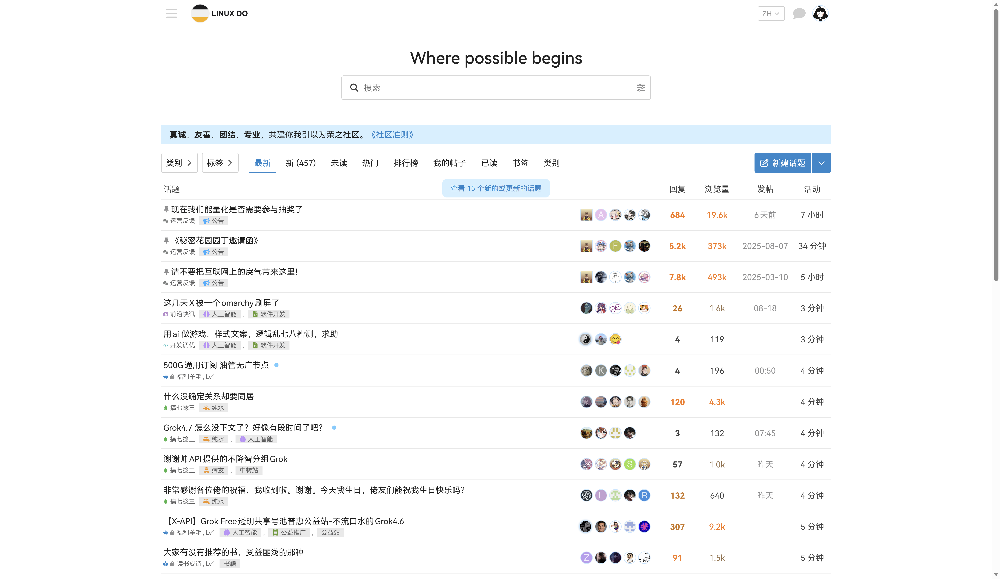

# 开发工具集

这是一个用于存放日常开发脚本的工具集仓库。

## 终端工具

**文件**: [windows-terminal.json](./windows-terminal.json) | [starship.toml](./starship.toml)

- **windows-terminal.json** - Windows Terminal 的配置文件，包含主题、快捷键、终端配置等设置
- **starship.toml** - Starship 跨平台 shell 提示符的配置文件，支持 Fish/Bash/Zsh 等多种 shell

## Fish Shell 开发工具

**文件**: [devtools.fish](./devtools.fish)

### Git 别名

- `main` - 切换到 main 分支
- `cl` - git clone 的简写
- `gp` - git push 的简写
- `gd` - 删除所有非 main 分支
- `gpl` - git pull --rebase 的简写
- `gnoe` - git commit --amend --reset-author --no-edit 的简写
- `gc` - git checkout 的简写
- `gda` - 获取最新分支并删除所有非 main 分支

### Node.js 工具

- `node-lts` - 安装并配置最新的 Node.js LTS 版本（使用 fnm），同时自动安装：
  - `@antfu/ni` - 统一的包管理器运行器
  - `@openai/codex` - OpenAI Codex CLI 工具

### 其他工具

- `kp <port>` - 杀死指定端口的进程
- `py` - python3 的别名
- `myip` - 检查代理是否工作（显示 IP 信息）
- `d` - `nr dev` 的别名（需要 @antfu/ni）
- `e` - `edit.exe` 的别名（Windows 编辑器）

## 工具列表

| 工具 | 描述 | 文件 |
|------|------|------|
| **YouTube 视频截图** | 视频截图当前时间戳，保存、复制截图 | [youtube-screenshot.user.js](./youtube-screenshot.user.js) |
| **中英文空格排版** | 中英/数字混排的视觉留白（不改文本）；跳过输入框、代码块和可编辑区域。 | [cjk-latin-autospace.user.js](./cjk-latin-autospace.user.js) |
| **x.user.js** | 树状结构标记 X 左侧栏相关页面元素 | [x.user.js](./x.user.js) |
| **X 回复过滤** | 从用户 `/with_replies` 里筛出有非本人回复的回复，并可内联展开对话。 | [x-reply-filter.user.js](./x-reply-filter.user.js) |
| **x-com-block.user.js** | 黑名单csv批量屏蔽 | [x-com-block.user.js](./x-com-block.user.js) |
| **m365-copilot-gpt-deep-thinking** | 打开 Microsoft 365 Copilot 聊天页时，自动通过模型选择器多级菜单将模型设为「GPT 5.6 深度思考」 | [m365-copilot.user.js](./m365-copilot.user.js) |
| **linux.do 发帖时间列** | 给 linux.do 话题列表在"活动"列前新增发帖时间列 | [linux-do-post-time.user.js](./linux-do-post-time.user.js) |


### x-clean.user.js

- 隐藏不必要的营销按钮
- 右侧边栏快捷搜索
- 马赛克 DEMO 模式

```text
header[role="banner"]  (width=88 via CSS)
└─ div (header 内第一个/唯一 div, width=88 via CSS)
   └─ div (top-parent, width=88 via JS；flex column; justify-content: space-between)
      ├─ div (top)
      │  ├─ div (logo)
      │  ├─ div (left-top)
      │  │  └─ nav[role="navigation"]
      │  │     ├─ a[href="/home"] ...
      │  │     ├─ a[href="/notifications"] ...
      │  │     └─ ...
      │  └─ div (left-middle)
      │     └─ a[href="/compose/post"]  (发帖按钮)
      └─ div (account)
         └─ div (account-inner / wrapper)
            └─ button[data-testid="SideNav_AccountSwitcher_Button"] avatar
               ├─ div (userAvatar-parent)
               │  └─ div[data-testid="UserAvatar-Container-<username>"] userAvatar
               ├─ div (extra-1, 宽度变小时会隐藏)
               └─ div (extra-2, 宽度变小时会隐藏)
```

### linux.do 发帖时间列

- **功能描述**：给 linux.do 的话题列表（首页、`/tag/*`、分类页、话题内推荐列表）在"活动"列前新增一列**发帖时间**。Discourse 列表页只渲染最后回复时间，创建时间只存在于列表 JSON 里；脚本在 `document-start` 拦截页面的 fetch/XHR，从 `.json` 列表响应和 message-bus 长轮询（实时插入的新主题只在这里）收集创建时间（`#data-preloaded` 首屏内嵌数据 + localStorage 缓存兜底），再给每张 `.topic-list` 表注入表头与单元格。SPA 路由切换、无限滚动、Ember 重渲染由 MutationObserver + 低频轮询补齐；移动端和 Horizon 卡片主题改以内联小字挂进活动时间节点。
- **显示规则**：与"活动"列同风格的紧凑格式——今天显示 `HH:mm`，昨天/前天显示"昨天/前天"，一周内显示 `N天前`，更早显示日期（当年 `MM-DD`，往年 `YYYY-MM-DD`），悬停可看完整本地时间。


